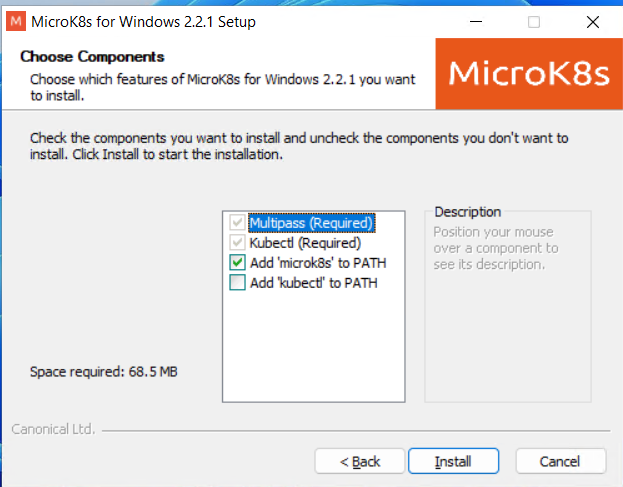

# intall guide
# linux
## basic installs
### install kubectl 
linux: https://kubernetes.io/docs/tasks/tools/install-kubectl-linux/
### install helm
<pre><code>curl -sfL https://get.k3s.io | K3S_KUBECONFIG_MODE="644" INSTALL_K3S_EXEC="server --disable=traefik" sh -
chmod 700 get_helm.sh
 ./get_helm.sh
</code></pre>
note: if you do not plan on using Azure arc for deploying logic apps or functions you can do curl -sfL **https://get.k3s.io | sh -** to have traefik.
### Install azure cli
#### linux
<pre><code>curl -sL https://aka.ms/InstallAzureCLIDeb | sudo bash
</code></pre>
## Step1: kubernetes
First check is there is a cluster running with **kubectl cluster-info**. if not:
### Linux
<pre><code>curl -sfL https://get.k3s.io | sh - 
</code></pre>
setup kubectl access
<pre><code>sudo mkdir ~/.kube
sudo cp /etc/rancher/k3s/k3s.yaml ~/.kube/config
sudo chmod 666 ~/.kube/config
</code></pre>
## Step 2: pull HELM chart
Download the **helm.zip** folder in this repository and unzip it
or 
<pre><code>
wget https://github.com/invictus-integration/docs-ifa/raw/laurent-hybrid-solution/framework/hybrid/helm.zip
</code></pre>
todo: update this to master before pull request
## Step 3: deploy HELM chart
in the helm directory open a terminal and execute:
<pre><code>helm upgrade --install {name} . --values values.yaml --set imagePullSecret.username={username} --set imagePullSecret.password={password} --set Framework.APPINSIGHTS_INSTRUMENTATIONKEY={appinsights_instrumentationkey} --set Framework.InvictusDashboardConnectionString="{InvictusDashboardConnectionString}" --set SQL.sapassword={sqlpassword} --set rabbitMQ.authentication.password={rabbitmqpassword} --set rabbitMQ.authentication.erlangCookie={erlangcookie} --set tag={releaseverion}

replace the bracketed values with the wanted ones
| Variable                            | Description                                               |
| ----------------------------------- | --------------------------------------------------------- |
| {name}                              | wanted name of the helm chart                             |
| {username}                          | username given by codit products                          |
| {password}                          | password given by codit products                          |
| {appinsights_instrumentationkey}    | the appinstights key                                      |
| {InvictusDashboardConnectionString} | dashboard connection string                               |
| {sqlpassword}                       | the sql password you want to set (any random string)      |
| {rabbitmqpassword}                  | the rabbitmq password you want to set (any random string) |
| {erlangcookie}                      | the erlang cookie (any random string)                     |
| {releaseverion}                     | the version of the release you want                       |

### optional settings
In the README.md you can find all the optional parameters.
Some interesting are:
If the below parameters are set, the corresponding resource will not be created on the cluster but will instead use the provided connection string
<pre><code>--set existingSQLConnectionString={connectionstring}</code></pre>
<pre><code>--set PubSub.RmqConnectionString={amqpconnectionstring}</code></pre>

If you want to deploy it into an other namespace the default
<pre><code>-n {namespace}</code></pre>

## Step 4: enable arc

login to azure

<pre><code>az login
</code></pre>
Register providers for Azure Arc-enabled Kubernetes
<pre><code>az provider register --namespace Microsoft.Kubernetes
az provider register --namespace Microsoft.KubernetesConfiguration
az provider register --namespace Microsoft.ExtendedLocation
</code></pre>
Connect an existing Kubernetes cluster
<pre><code>az connectedk8s connect --name {name} --resource-group {resource-group}
</code></pre>
| Variable         | Description                        |
| ---------------- | ---------------------------------- |
| {name}           | wanted name arc cluster            |
| {resource-group} | resource group for the arc cluster |

# Windows
note: i advice using a base linux operating system. But kubernetes can run anywhere even on Windows OS.
## basic installs
### install kubectl 
windows: https://kubernetes.io/docs/tasks/tools/install-kubectl-windows/
### Install azure cli
https://learn.microsoft.com/en-us/cli/azure/install-azure-cli-windows?tabs=azure-cli
## Step1: kubernetes
https://microk8s.io/microk8s-installer.exe
follow the installer
 - press next
 - pressI Agree
 -  **add microk8s to PATH** is needed, 'kubectl' is optional
  
 - press install
 - press next
 - pressI Agree
 - select Microsoft Hyper-V (Recommended)
  
 - press next
 - select Add multipass to current user's PATH  (Recommended) => **this is very important**
 - press next
 - press next again
 - press install
 - press Finnish
  
next run:
<pre><code>microk8s start</code></pre>
run **microk8s status** to make sure the microk8s is running
### Install helm
<pre><code>microk8s enable helm3</code></pre>

## Step 2: pull HELM chart
<pre><code> multipass shell microk8s-vm</code></pre>
<pre><code>
wget https://github.com/invictus-integration/docs-ifa/raw/laurent-hybrid-solution/framework/hybrid/helm.zip
</code></pre>
<pre><code>sudo apt install unzip</code></pre>
<pre><code>unzip helm.zip</code></pre>
## Step 3: deploy HELM chart
in the helm directory open a terminal and execute:
<pre><code>helm upgrade --install {name} . --values values.yaml --set imagePullSecret.username={username} --set imagePullSecret.password={password} --set Framework.APPINSIGHTS_INSTRUMENTATIONKEY={appinsights_instrumentationkey} --set Framework.InvictusDashboardConnectionString="{InvictusDashboardConnectionString}" --set SQL.sapassword={sqlpassword} --set rabbitMQ.authentication.password={rabbitmqpassword} --set rabbitMQ.authentication.erlangCookie={erlangcookie} --set tag={releaseverion}

replace the bracketed values with the wanted ones
| Variable                            | Description                                               |
| ----------------------------------- | --------------------------------------------------------- |
| {name}                              | wanted name of the helm chart                             |
| {username}                          | username given by codit products                          |
| {password}                          | password given by codit products                          |
| {appinsights_instrumentationkey}    | the appinstights key                                      |
| {InvictusDashboardConnectionString} | dashboard connection string                               |
| {sqlpassword}                       | the sql password you want to set (any random string)      |
| {rabbitmqpassword}                  | the rabbitmq password you want to set (any random string) |
| {erlangcookie}                      | the erlang cookie (any random string)                     |
| {releaseverion}                     | the version of the release you want                       |

### optional settings
In the README.md you can find all the optional parameters.
Some interesting are:
If the below parameters are set, the corresponding resource will not be created on the cluster but will instead use the provided connection string
<pre><code>--set existingSQLConnectionString={connectionstring}</code></pre>
<pre><code>--set PubSub.RmqConnectionString={amqpconnectionstring}</code></pre>

If you want to deploy it into an other namespace the default
<pre><code>-n {namespace}</code></pre>

## Step 4: enable arc
enable kubectl
<pre><code>
cd %USERPROFILE%
mkdir .kube
cd .kube
microk8s config > config
</code></pre>
enable kubernetes dns extension
<pre><code> microk8s enable dns</code></pre>
login to azure
<pre><code>az login
</code></pre>
Register providers for Azure Arc-enabled Kubernetes
<pre><code>az provider register --namespace Microsoft.Kubernetes
az provider register --namespace Microsoft.KubernetesConfiguration
az provider register --namespace Microsoft.ExtendedLocation
</code></pre>
Connect an existing Kubernetes cluster
<pre><code>az connectedk8s connect --name {name} --resource-group {resource-group}
</code></pre>
| Variable         | Description                        |
| ---------------- | ---------------------------------- |
| {name}           | wanted name arc cluster            |
| {resource-group} | resource group for the arc cluster |