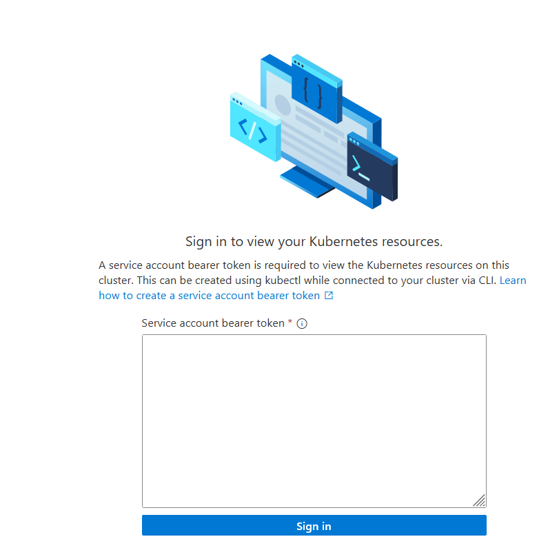

# Install guide
This installation guide will walk through the process of installing the Invictus framework components in a hybrid setting on on-premise environments. 

## Install prerequisites
We support both Linux and Windows installations. Please make sure that the necessary prerequisites services are installed by following these steps:
* [Linux](./prerequisites/installguide-linux.md) (🥇 Recommended)
* [Windows](./prerequisites/installguide-windows.md)

## Deploy HELM chart
login to the acr to pull the helm chart
```shell
> helm registry login invictusdevacracr.azurecr.io --username {username} --password {password}
```
todo: update this to master before pull request
```shell
> helm upgrade \
  --install {name} oci://invictusdevacracr.azurecr.io/helm/invictus-on-premise \
  --version 1.0.0 \
  --set imagePullSecret.username={username} \
  --set imagePullSecret.password={password} \
  --set Framework.APPINSIGHTS_INSTRUMENTATIONKEY={appinsights_instrumentationkey} \
  --set SQL.sapassword={sqlpassword} \
  --set rabbitMQ.authentication.password={rabbitmqpassword} \
  --set rabbitMQ.authentication.erlangCookie={erlangcookie} \
  --set tag={releaseverion}
```

replace the bracketed values with the wanted ones
| Variable                           | Description                                               |
| ---------------------------------- | --------------------------------------------------------- |
| `{name}`                           | wanted name of the helm chart                             |
| `{username}`                       | username given by codit products                          |
| `{password}`                       | password given by codit products                          |
| `{appinsights_instrumentationkey}` | the appinstights key                                      |
| `{sqlpassword}`                    | the sql password you want to set (any random string)      |
| `{rabbitmqpassword}`               | the rabbitmq password you want to set (any random string) |
| `{erlangcookie}`                   | the erlang cookie (any random string)                     |
| `{releaseverion}`                  | the version of the release you want                       |

### Optional settings
In the `README.md` you can find all the optional parameters.
Some interesting are:
If the below parameters are set, the corresponding resource will not be created on the cluster but will instead use the provided connection string
```shell
--set existingSQLConnectionString={connectionstring}
--set PubSub.RmqConnectionString={amqpconnectionstring}
--set existingDurableSQLConnectionString={durableconnectionstring}
```

If you want to deploy it into an other namespace the default
`-n {namespace}`

## Enable arc
run arc.ps1
```shell
> powershell .\arc.ps1 {name} {resource-group} {serviceaccount}
```
| Variable           | Description                                                      |
| ------------------ | ---------------------------------------------------------------- |
| `{name}`           | wanted name arc cluster                                          |
| `{resource-group}` | resource group for the arc cluster                               |
| `{serviceaccount}` | the name of the kubernetes service account it uses for the token |

at the end the script returns a bearer token. that one is used the authenticate in the portal.



## or

Login to Azure:

```shell
> az login
```

Register providers for Azure Arc-enabled Kubernetes
```shell
> az provider register --namespace Microsoft.Kubernetes
> az provider register --namespace Microsoft.KubernetesConfiguration
> az provider register --namespace Microsoft.ExtendedLocation
```

Connect an existing Kubernetes cluster
```shell
> az connectedk8s connect --name {name} --resource-group {resource-group}
```

| Variable           | Description                        |
| ------------------ | ---------------------------------- |
| `{name}`           | wanted name arc cluster            |
| `{resource-group}` | resource group for the arc cluster |

> The command may ask to install the extension `connectedk8s` if it is not installed on the system. A outdated version of `az` may also result in problems running this extension. Try upgrading the Azure CLI with `az upgrade` and run the command again.

