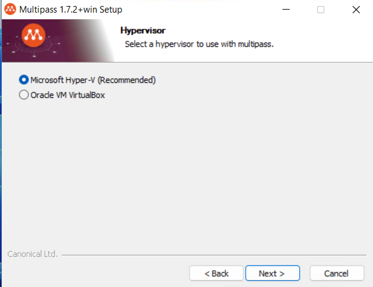

# Install prerequisites on a Windows on-premise machine
This sub-installation guide will walk through the process of installing any prerequisites on a Windows OS-based on-premise machine.

> 💡 Note: it is advised to a base Linux operating system. But Kubernetes can run anywhere even on Windows OS.

## Install Kubectl
The Invictus framework components run in a hybrid solution on a [Kubernetes](https://kubernetes.io/docs/concepts/overview/) cluster, which means that the Kuberctl has to be installed on the on-premise machine.

[Installing Kuberctl on Windows](https://kubernetes.io/docs/tasks/tools/install-kubectl-windows/)

## Install Helm
To deploy the Invictus framework components on a Kubernetes cluster, you need the [Helm](https://helm.sh/) package manager of Kubernetes.

Run the following shell commands to install Helm on your Windows machine:

```shell
> choco install kubernetes-helm
```

> 💡 If you still need to install chocolatey you can find the info here: https://chocolatey.org/install

To verify that helm is installed you can run:
```shell
> helm help
```
## Install Azure CLI
To deploy the Invictus framework components using Azure ACR, you need to install the [Azure CLI](https://learn.microsoft.com/en-us/cli/azure/what-is-azure-cli) command tool to interact with Azure.

Follow [this section](https://learn.microsoft.com/en-us/cli/azure/install-azure-cli-windows?tabs=azure-cli) to install the Azure CLI command tool on your machine.

To verify that azure cli is installed you can run:
```shell
> az --version
```

## Install Microk8s
To easily get your Kubernetes cluster up and running, consider using the lightweight [Microk8s](https://microk8s.io/).

[Download Microk8s](https://microk8s.io/microk8s-installer.exe)

Follow the installer
 - Press `Next`
 - Press `I Agree`
 - ❗ **Add Microk8s to PATH** is needed, `kubectl` is optional
  
 - Press `install`
 - Press `Next`
 - Press `I Agree`
 - Select `Microsoft Hyper-V (Recommended)`
  
 - Press next
 - ❗ Select `Add multipass to current user's PATH  (Recommended)`
 - Press `Next`, `Install`, `Finish`

Afterwards, start the Microk8s service and make sure that the service is running:
```shell
> microk8s start
> microk8s status
```

> 💡 Note that you have to reload/restart the command prompt to be able to run `microk8s` (so that the prompt is using the most recent updated PATH environment variable). 

## Configure Kubernetes setup
Lastly, make sure that Kubernetes uses the `~/.kube` folder to store its configuration:
```shell
> cd %USERPROFILE%
> mkdir .kube
> cd .kube
> microk8s config > config
```
To verify if Kubernetes is correctly installed and configured, check if there 
is a cluster running with `kubectl cluster-info`

And enable the Kubernetes dns extension so that it can interact with Azure resources.
```shell
> microk8s enable dns
```

## Done
After installing Kubernetes, Helm, and Azure, you can continue with [installing and setting up the Invictus framework components](../installguide.md). 